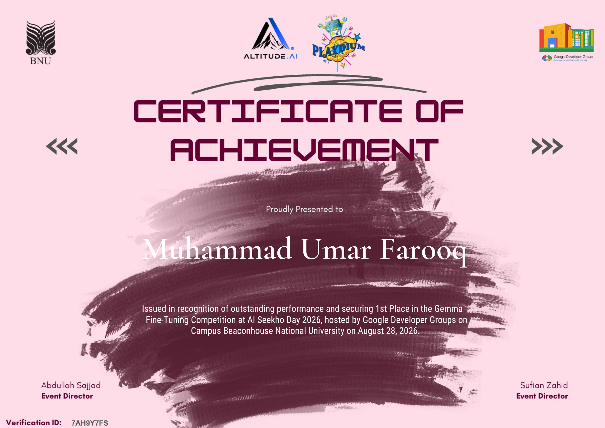

# Gemma Claim Verification

I built this project for **AI Seekho Day 2026**, where it placed **first**. It uses a QLoRA adapter on Gemma 4 12B to classify a claim against supplied evidence. My selected checkpoint scored **94.40% accuracy** and **94.38% macro-F1** on the 500-example event-day test set.

<p align="center">
  <a href="https://huggingface.co/google/gemma-4-12B-it"></a>
  <a href="https://huggingface.co/omerfarooq223/gemma-4-12b-evidence-verification-qlora"></a>
  <a href="https://huggingface.co/spaces/omerfarooq223/gemma-claim-verifier"></a>
  <a href="https://github.com/omerfarooq223/gemma-claim-verification"></a>
</p>

| Resource | Identifier / Link | Description |
|---|---|---|
| **Base Model** | [`google/gemma-4-12B-it`](https://huggingface.co/google/gemma-4-12B-it) | Google Gemma 4 12B instruction-tuned foundation model |
| **Model Adapter** | [`omerfarooq223/gemma-4-12b-evidence-verification-qlora`](https://huggingface.co/omerfarooq223/gemma-4-12b-evidence-verification-qlora) | 1st-place QLoRA adapter weights on Hugging Face Hub |
| **Live Demo** | [Hugging Face Space](https://huggingface.co/spaces/omerfarooq223/gemma-claim-verifier) | Interactive Gradio verification web application on ZeroGPU |
| **Source Code** | [GitHub Repository](https://github.com/omerfarooq223/gemma-claim-verification) | Complete training, inference, and evaluation repository |

<p align="center">
  <a href="docs/certificate.png">
    
  </a>
</p>

<p align="center"><em>First place in the Gemma Fine-Tuning Competition at AI Seekho Day 2026.</em></p>

## What it does

The model evaluates a claim against supplied evidence passages and returns one of three relation labels:

| Label | Meaning |
|---|---|
| `SUPPORTS` | The evidence establishes the claim. |
| `REFUTES` | The evidence contradicts the claim. |
| `NOT_ENOUGH_INFO` | The evidence does not settle the claim either way. |

For example:

```text
Claim: The company's revenue declined in 2023.
Evidence: Revenue rose from $1.2 billion in 2022 to $1.5 billion in 2023.

FINAL: REFUTES
```

The model evaluates the claim strictly grounded within the provided evidence passages. It does not browse the web or check external knowledge sources. Evidence-only prompting is part of the training setup, ensuring bounded and traceable reasoning.

## Results

These are the recorded results for my selected competition checkpoint:

| Evaluation set | Examples | Accuracy | Macro-F1 |
|---|---:|---:|---:|
| Organizer validation | 300 | 92.33% | 92.27% |
| External stress set | 30 | 93.33% | 93.64% |
| Blind holdout | 120 | 93.33% | 93.37% |
| Event-day test | 500 | **94.40%** | **94.38%** |

On the event-day test, 472 of 500 predictions were correct, with zero invalid or unparseable outputs. Most errors were subtle contradictions classified as support (26 examples with a true label of `REFUTES` were predicted as `SUPPORTS`).

The [experiment history](docs/experiments.md) includes detailed logs for all evaluation sets, earlier checkpoints, and the reproduction run.

## How to run

Requirements: Python 3.10+ and an NVIDIA CUDA GPU for the 4-bit setup (the reference training environment used a T4 with 16 GB VRAM).

```bash
git clone https://github.com/omerfarooq223/gemma-claim-verification.git
cd gemma-claim-verification
python3 -m venv .venv
source .venv/bin/activate
pip install -e '.[app]'
python app.py
```

Open `http://localhost:7860`. The first model load downloads both the base weights and my adapter:

- Base Model: [`google/gemma-4-12B-it`](https://huggingface.co/google/gemma-4-12B-it)
- Adapter: [`omerfarooq223/gemma-4-12b-evidence-verification-qlora`](https://huggingface.co/omerfarooq223/gemma-4-12b-evidence-verification-qlora)

If Hugging Face prompts for authentication, run `hf auth login` locally. On Spaces, supply an `HF_TOKEN` secret. See [HUGGINGFACE_GUIDE.md](HUGGINGFACE_GUIDE.md) for full deployment details.

### Predict from a file

To run predictions on a JSONL file:

```bash
python scripts/predict.py \
  --test data/examples/sample.jsonl \
  --adapter omerfarooq223/gemma-4-12b-evidence-verification-qlora \
  --config configs/final_inference.yaml \
  --output outputs/submission.csv
```

A local adapter directory can also be passed to `--adapter`. Input format is JSONL with one record per line:

```json
{"id": "example-1", "claim": "Revenue declined in 2023.", "evidence": ["Revenue rose from $1.2B in 2022 to $1.5B in 2023."], "label": "REFUTES"}
```

To evaluate predictions against gold labels:

```bash
python scripts/evaluate.py \
  --gold data/examples/sample.jsonl \
  --predictions outputs/submission.csv \
  --output_json outputs/metrics.json
```

## How I trained it

The main focus was systematic data curation and targeted contrastive examples. The raw training set had 1,000 rows; after my 10-step audit, 935 high-quality examples remained. I generated 150 contrastive examples targeting numerical shifts, swapped entities, and partial evidence, reaching a final training set of **1,085 curated examples**.

| Setting | Value |
|---|---|
| Base model | Gemma 4 12B instruction-tuned |
| Quantization | 4-bit NF4, double quantization, FP16 compute |
| LoRA | Rank 8, alpha 16, dropout 0.05 |
| Target projections | `q_proj`, `k_proj`, `v_proj`, `o_proj`, `gate_proj`, `up_proj`, `down_proj` |
| Learning rate | `2e-4` |
| Effective batch size | 16 |
| Training | 2 epochs, 136 optimizer steps |
| Loss | Assistant completion only: `FINAL: <LABEL>` |
| Inference | Greedy decoding, thinking disabled, up to 24 new tokens |

I trained the final adapter from a fresh base model. For in-depth documentation, see the [data audit](docs/data_audit.md), [methodology](docs/methodology.md), and [final competition notebook](notebooks/final_competition_notebook.ipynb).

### Retraining

The competition data and audited contrastive files are documented in [data/README.md](data/README.md). Once those files are placed in `data/derived/`:

```bash
python scripts/train_qlora.py \
  --config configs/final_train.yaml \
  --train_clean data/derived/train_clean_v3_semantic.jsonl \
  --contrastive data/derived/d4_contrastive_train_v1.jsonl \
  --output_dir checkpoints/final_adapter
```

To verify the weights of my winning checkpoint against the recorded SHA-256 hash:

```bash
python scripts/verify_artifact.py \
  checkpoints/final_adapter/adapter_model.safetensors \
  --key selected_final_adapter
```

Expected SHA-256:

```text
76630ec4620ff7244f3b6c9ef0350617939d33a5bc6f0e9c545816175b646d8e
```

## Repository guide

| Path | Contents |
|---|---|
| `app.py` | Gradio demo for local use and Hugging Face Spaces |
| `src/gemma_claim_verification/` | Data cleaning, prompts, model loading, training, inference, and evaluation |
| `scripts/` | Command-line entry points |
| `configs/` | Training and inference settings |
| `tests/` | Tests for data processing and inference behavior |
| `notebooks/` | Final competition run and development history |
| `docs/` | Methodology, experiments, model card, and provenance |
| `data/` | Sample records and instructions for competition files |

Run the test suite:

```bash
PYTHONPATH=src python -m unittest discover -s tests -v
```

## Author & License

Developed and open-sourced by **[Muhammad Umar Farooq](https://github.com/omerfarooq223)** ([Portfolio](https://omerfarooq223.github.io/) · [GitHub](https://github.com/omerfarooq223) · [Hugging Face](https://huggingface.co/omerfarooq223)).

- **Code & Adapter Weights**: Licensed under the [Apache 2.0 License](LICENSE).
- **Base Model**: Gemma 4 12B is provided by Google under the [Gemma Terms of Use](https://huggingface.co/google/gemma-4-12B-it).

If you build on or cite this work:

```bibtex
@misc{farooq2026gemma4claimverification,
  author = {Farooq, Muhammad Umar},
  title = {Reliable Evidence-Based Claim Verification with Gemma 4 12B},
  year = {2026},
  publisher = {GitHub and Hugging Face},
  howpublished = {\url{https://github.com/omerfarooq223/gemma-claim-verification}}
}
```

