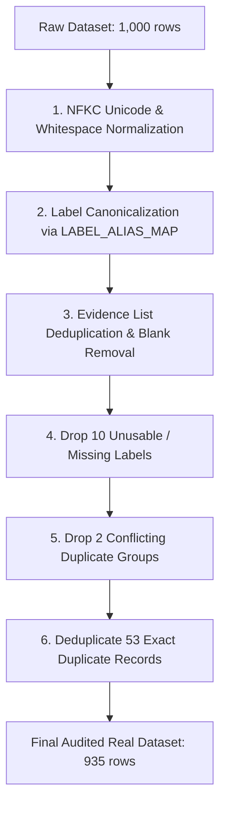

# Data Quality Audit & Contrastive Curriculum

This document outlines the systematic auditing, cleaning, and contrastive curriculum design that produced the 1,085-example training set.

---

## 1. Raw Dataset Audit (1,000 Rows)

An initial structural and semantic audit of the 1,000 raw training examples revealed substantial noise:

| Issue Identified | Count / Instances | Impact on Training |
|---|---|---|
| **Missing / Unusable Labels** | 10 rows | Empty strings or unparseable labels causing gradient contamination. |
| **Label Alias Inconsistencies** | 45 rows | Variations such as `refutes`, `supports`, `NEI`, `SUPPORTED`, `not enough info`. |
| **Duplicate Claim-Evidence (Exact)** | 53 pairs | Artificially inflated loss weighting on duplicated examples. |
| **Conflicting Duplicate Labels** | 2 pairs | Identical claim and evidence assigned contradictory labels (`SUPPORTS` vs `REFUTES`). |
| **Whitespace & Unicode Artifacts** | Universal | Non-breaking spaces (`\u00a0`), multi-space runs, and trailing whitespace. |
| **Redundant Evidence Passages** | 30 instances | Exact repeated evidence strings within a single example. |

---

## 2. 10-Step Cleaning Pipeline Execution

### Class Distribution Shift:
- **Raw (1,000)**: SUPPORTS: 365, REFUTES: 332, NOT_ENOUGH_INFO: 293, Blank/Invalid: 10
- **Audited Clean (935)**: **SUPPORTS: 348, REFUTES: 311, NOT_ENOUGH_INFO: 276**
- **SHA-256 Checksum**: `b706dbf0c0b4aab4cbcd07bb89c5d018f7c41e47a55b757016ef3d07a9713337`

---

## 3. Contrastive Curriculum Design (150 Rows)

Error analysis on baseline models revealed recurring difficulties on subtle decision boundaries:
1. **Numerical / Temporal Inversions**: Distinguishing claims where quantities or years were reversed.
2. **Partial Evidence vs Entailment**: Evidence mentioning relevant entities but missing key asserting verbs.
3. **Explicit Contradiction vs Missing Context**: Distinguishing statements contradicted by facts from statements unsupported by facts.

### The Contrastive Trio Methodology
We synthesized 225 candidate contrastive items structured in triplets (sharing identical evidence, with 3 claim variants generating `SUPPORTS`, `REFUTES`, and `NOT_ENOUGH_INFO`).

### Revenue-Auditor Direction-Bug Correction
The initial independent semantic audit produced five apparent revenue-label disagreements because the audit parser reversed the year direction in constructions such as:
> *"20% higher in 2023 than in 2022"*

The generated examples themselves were correct. A phrase-aware auditor was implemented and all 60 revenue examples were independently rechecked, achieving **60/60 agreement** and restoring the complete **225/225 semantic audit**.

After verification, the dataset was frozen and partitioned:
- **150 Examples**: Assigned to training (`d4_contrastive_train_v1.jsonl`, SHA `17258cbc0e40f4ebd1cd4d583e3a331e59217d62cf4ff36741e8b1e3a7a98f41`).
- **75 Examples**: Assigned to holdout evaluation (`D4_FROZEN_HOLDOUT_V1_DO_NOT_TRAIN.jsonl`, SHA `61f41a537f738ecd153474565c1e22bb678c4f8a9dd096ed9eabfe5bddc2e1b2`).

---

## 4. Final Training Curriculum Composition

$$\text{Total Training Set} = 935\text{ Real Clean} + 150\text{ Audited Contrastive} = 1,085\text{ Examples}$$

| Class | Real Clean (935) | Contrastive (150) | Final Curriculum (1,085) | Proportion |
|---|---|---|---|---|
| **SUPPORTS** | 348 | 50 | **398** | 36.68% |
| **REFUTES** | 311 | 50 | **361** | 33.27% |
| **NOT_ENOUGH_INFO** | 276 | 50 | **326** | 30.05% |
| **Total** | **935** | **150** | **1,085** | **100.0%** |
