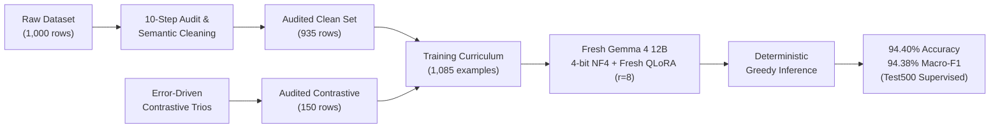

# Technical Methodology

## 1. Problem Formulation

The task requires evidence-grounded three-way classification of natural language claims given one or more supporting or refuting text passages.

Given an input pair $(\text{Claim}, \text{Evidence})$, the model outputs exactly one label:
- $\text{SUPPORTS}$: The supplied evidence directly establishes the truth of the claim.
- $\text{REFUTES}$: The supplied evidence directly contradicts the claim.
- $\text{NOT\_ENOUGH\_INFO}$: The supplied evidence neither establishes nor contradicts the specific claim.

### Evidence-Only Grounding Constraint
The system is explicitly supervised to base judgments **exclusively on the provided evidence passages**, ignoring external pre-training knowledge. This prevents hallucinations and enforces faithful factual consistency.

---

## 2. Data Quality & Curriculum Design

### 2.1 The 10-Step Data Cleaning Pipeline
Rather than fitting models to noisy raw training data, we implemented a rigorous 10-step auditing pipeline:
1. **NFKC Unicode Normalization**: Standardizes non-breaking spaces and unicode variance.
2. **Whitespace Normalization**: Collapses repeated spaces, tabs, and unescaped newlines.
3. **Label Canonicalization**: Standardizes noisy aliases (e.g. `refutes`, `supports`, `NEI`, `SUPPORTED`).
4. **Evidence List Standardization**: Parses evidence into structured passage lists.
5. **Blank Passage Removal**: Filters empty evidence strings.
6. **Passage Deduplication**: Eliminates repeated passages within an example.
7. **Unusable Label Dropping**: Drops records with missing or ambiguous labels (10 examples).
8. **Conflicting Duplicate Resolution**: Identifies identical claim-evidence pairs with conflicting labels and eliminates them (2 examples).
9. **Exact Duplicate Removal**: Deduplicates identical claim-evidence-label records (53 examples).
10. **Semantic Verification & Final Freeze**: Verifies semantic consistency across all classes.

**Result**: 1,000 raw rows $\rightarrow$ **935 high-fidelity real examples**.

### 2.2 Failure-Driven Contrastive Augmentation & Semantic Auditor Correction
Rather than blindly expanding synthetic data volume (which experiments proved harmful), we created 150 targeted contrastive examples organized as balanced **trios**:
- Identical evidence passages paired with slightly altered claims testing:
  1. Complete entailment (`SUPPORTS`)
  2. Direct numerical/entity inversion (`REFUTES`)
  3. Insufficient specificity / missing information (`NOT_ENOUGH_INFO`)

During evaluation, an initial automated semantic audit flagged 5 apparent revenue-label disagreements. Investigation revealed the generated data was correct, but the audit parser had reversed the year direction in *"higher in X than in Y"* constructions. Implementing a phrase-aware auditor restored **60/60 revenue agreement** and verified the full **225/225 synthetic audit**.

**Final Curriculum**: **935 Real + 150 Contrastive = 1,085 Examples**.

---

## 3. Architecture & QLoRA Efficiency

### 3.1 Model Selection & Fresh Training
- **Base Model**: `google/gemma-4-12B-it`
- **Class**: `Gemma4UnifiedForConditionalGeneration` / `AutoModelForCausalLM`
- **Initialization**: The final production model was trained from a **fresh Gemma 4 12B base with a fresh LoRA initialization** using the recipe established during the D4 experiment.

### 3.2 Quantization & Memory Budget
Full FP32 weights for a 12B model require $\sim 48\text{ GB}$ VRAM, and FP16/BF16 requires $\sim 24\text{ GB}$, exceeding standard 16 GB accelerators (e.g. NVIDIA Tesla T4).

With **QLoRA (Quantized Low-Rank Adaptation)**:
- **Base Weights**: Frozen in 4-bit **NF4 (NormalFloat4)** with double quantization enabled.
- **Compute Precision**: **FP16** during forward/backward operations.
- **Trainable LoRA Adapters**: Attached to all language projections (`q_proj`, `k_proj`, `v_proj`, `o_proj`, `gate_proj`, `up_proj`, `down_proj`).
- **LoRA Parameters**: Rank $r=8$, $\alpha=16$, dropout $0.05$ $\rightarrow$ **32,784,384 trainable parameters** ($\sim 0.27\%$ of base weights).
- **Peak Memory**: Fits comfortably in $<15\text{ GB}$ VRAM.

---

## 4. Supervised Training Loop

- **Objective**: Completion-only language modeling supervision.
- **Target Format**: `FINAL: <LABEL><eos>`
- **Sequence Length**: Fixed 256 token limit (zero truncation observed across all 1,085 examples).
- **Optimizer**: AdamW ($lr = 2 \times 10^{-4}$, weight decay $= 0.01$).
- **Batching**: Per-device batch size 1, gradient accumulation 16 $\rightarrow$ Effective batch size 16.
- **Duration**: 2 Epochs (136 total optimizer steps, 5% cosine warmup).
- **Per-Epoch Shuffling**: `random.Random(seed + epoch)` ensuring deterministic batch variation.
